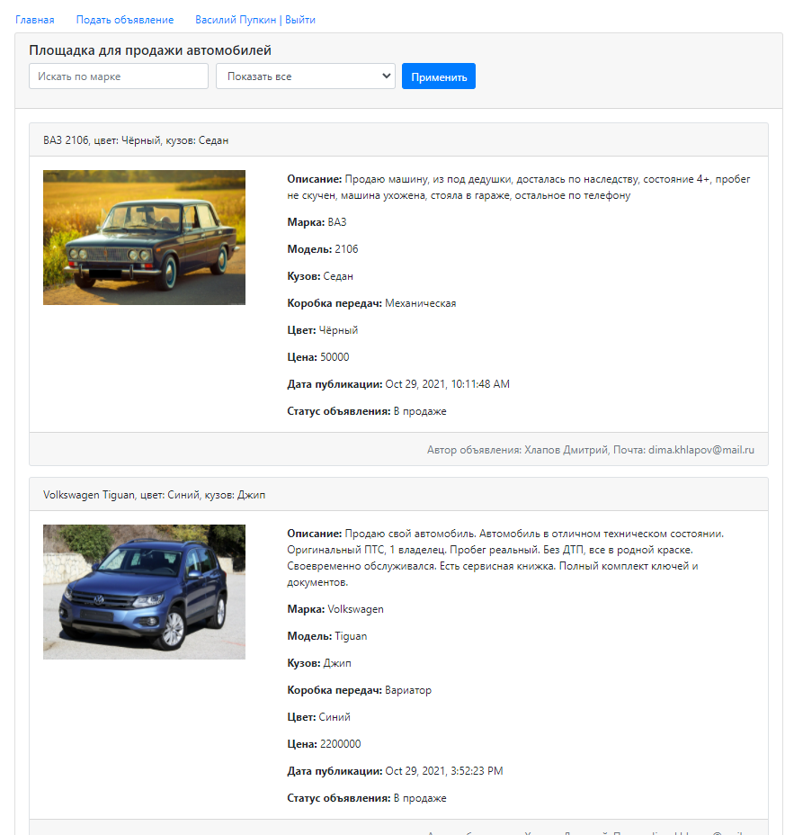

# Project job4j_cars
[](https://app.travis-ci.com/EDGE775/job4j_cars)
[](https://codecov.io/gh/EDGE775/job4j_cars)

> This webapp realizes CRUD-system with using of principle of MVC.

## Table of contents
* [General info](#general-info)
* [Technologies](#technologies)
* [Compilation](#compilation)
* [Status](#status)
* [Screenshots](#screenshots)
* [Contact](#contact)

## General info
This application is a marketplace for the sale of cars. 
Each authorised user can add new ads for sale, change their status. 
The main page of the application contains all active ads.
You can filter ads by brand, status, etc.

## Technologies
* Java 17
* Java EE Servlets
* PostgreSQL, HSQLDB
* Hibernate
* Apache TomCat
* Libraries:
    - Apache Commons FileUpload
    - GSON
* Javascript, jQuery, HTML, Bootstrap
* Maven
* Junit

## Compilation
```
mvn clean compile
```

## Status
Project is: _in progress_

## Screenshots
#### Main page

#### Manage of ad

#### Filtering

#### Create page

#### Registration

#### Authorization


## Contact
Created by Khlapov Dmitry - feel free to contact me!
